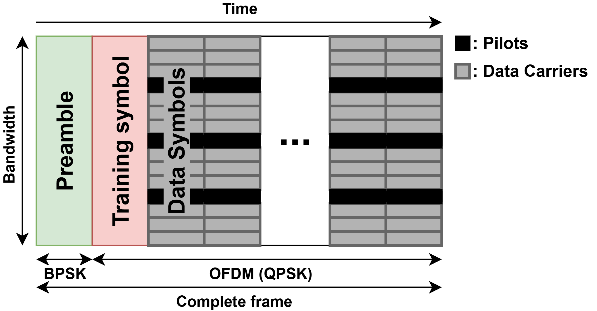
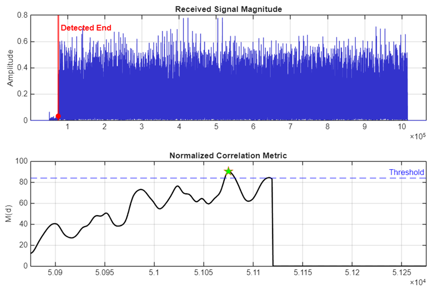
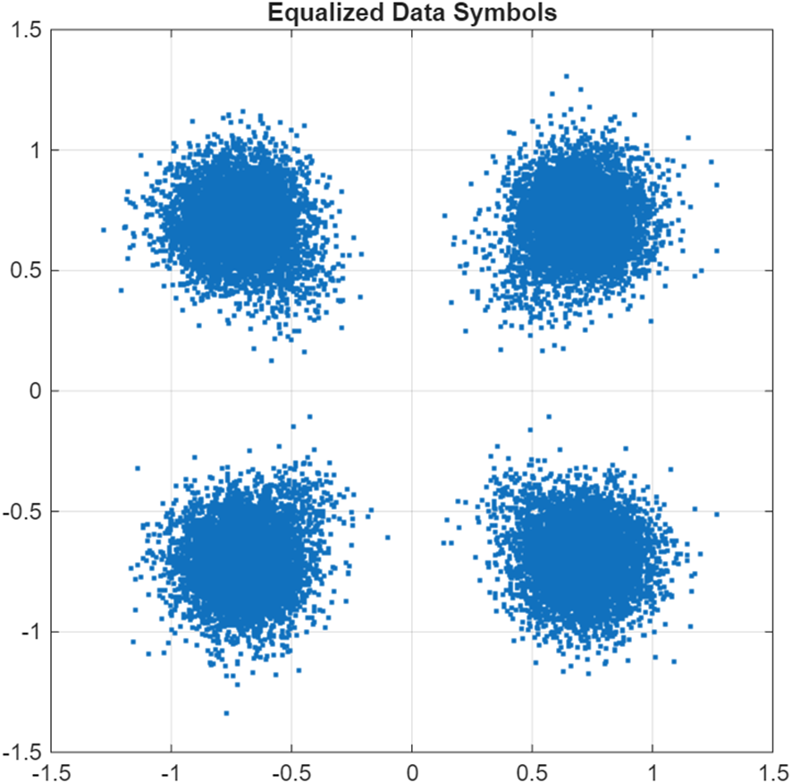
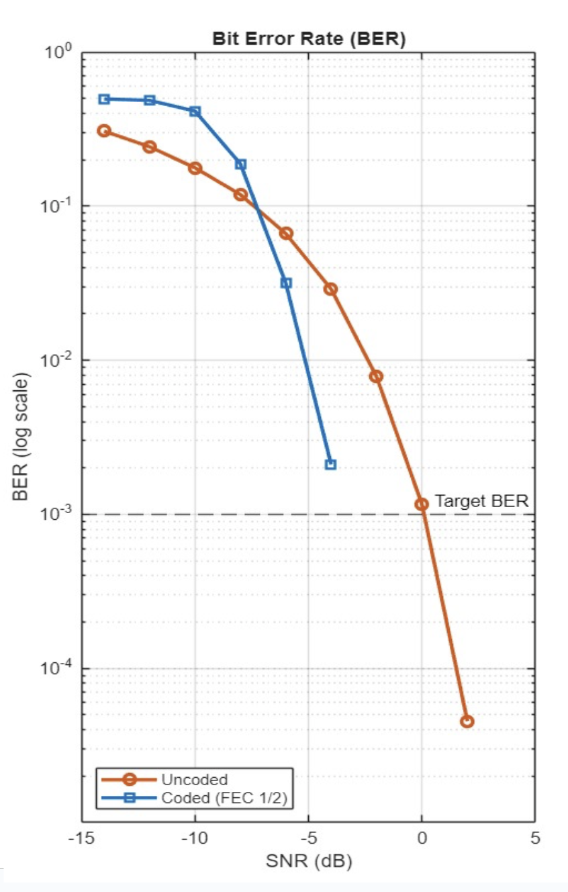
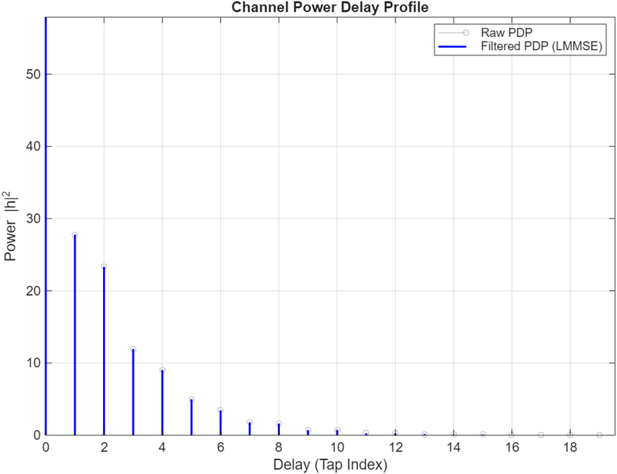
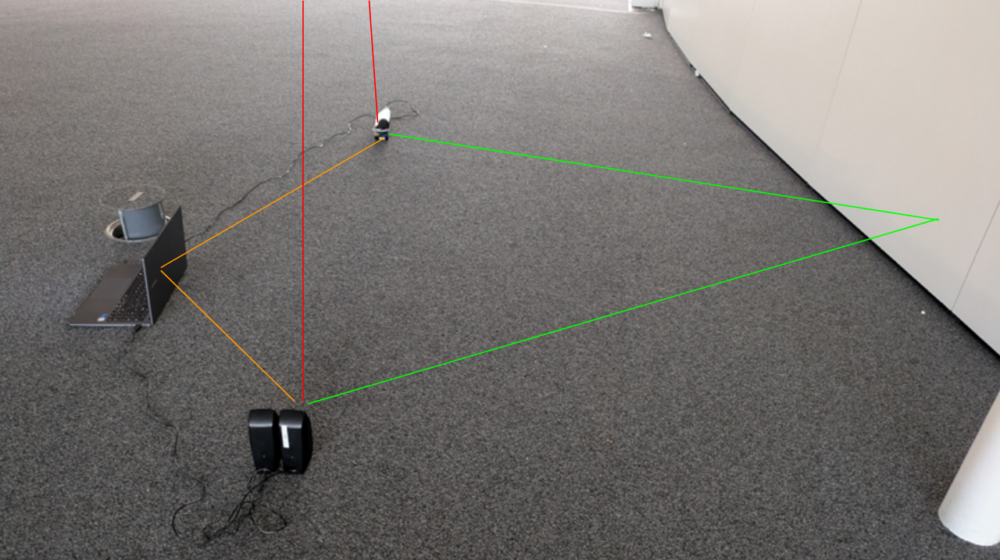
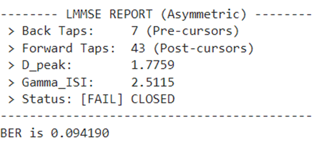

# Acoustic OFDM Transceiver and Wireless Communication System

[](https://www.mathworks.com/products/matlab.html)
[]()
[]()
[](https://www.epfl.ch)
[](docs/report.pdf)

An acoustic multicarrier communication system designed, implemented, and experimentally validated for reverberant, multipath-rich indoor acoustic environments. Developed at the **Telecommunications Circuits Laboratory (TCL), École Polytechnique Fédérale de Lausanne (EPFL)** as part of the *EE-442: Wireless Receivers — Algorithms and Architectures* curriculum.

---

## Table of Contents
1. [System Overview](#system-overview)
2. [System Specifications](#system-specifications)
3. [Transceiver Architecture](#transceiver-architecture)
4. [Digital Signal Processing Pipeline](#digital-signal-processing-pipeline)
   - [Frame Synchronization and Packet Detection](#frame-synchronization-and-packet-detection)
   - [Two-Stage Carrier Frequency Offset (CFO) Estimation](#two-stage-carrier-frequency-offset-cfo-estimation)
   - [Asymmetric Windowed LMMSE Channel Estimation](#asymmetric-windowed-lmmse-channel-estimation)
   - [Pilot-Assisted Residual Phase Tracking](#pilot-assisted-residual-phase-tracking)
   - [Concatenated Forward Error Correction](#concatenated-forward-error-correction)
5. [Channel Models and Equalization Analysis](#channel-models-and-equalization-analysis)
6. [Over-the-Air Experimental Validation](#over-the-air-experimental-validation)
7. [Repository Structure](#repository-structure)
8. [Getting Started](#getting-started)
9. [Documentation](#documentation)
10. [Authors and Acknowledgments](#authors-and-acknowledgments)

---

## System Overview

This repository implements a modular **Orthogonal Frequency Division Multiplexing (OFDM)** transceiver operating over acoustic passband frequencies ($f_c = 8\text{ kHz}$). Acoustic wireless channels exhibit physical impairments such as severe multipath delay spreads (reverberation), Doppler shifts, deep spectral nulls, and carrier frequency offsets.

The system addresses these challenges through:
- **Energy-normalized sliding cross-correlation** for robust packet arrival detection.
- **Two-stage frequency synchronization** combining Doppler grid search with parabolic interpolation ($<0.1\text{ Hz}$ resolution).
- **Asymmetric Circular-Shift LMMSE Channel Estimation** to isolate physical channel taps and suppress out-of-band noise.
- **Continuous pilot-assisted residual phase tracking** across OFDM symbol blocks.
- **Concatenated Forward Error Correction (FEC)** integrating an outer Reed-Solomon $RS(255, 239)$ code with an inner Rate $1/2$ Convolutional Code (Viterbi decoding).

The physical layer was validated both through Monte Carlo channel emulation and **over-the-air (OTA) audio transmissions** (loudspeaker to microphone) in the **EPFL Rolex Learning Center (RLC)**, achieving error-free image transmission ($BER = 0.000000$).

---

## System Specifications

| Parameter | Notation | Value | Specification Details |
| :--- | :--- | :--- | :--- |
| Audio Sampling Rate | $f_s$ | $48\text{ kHz}$ | Hardware DAC/ADC sampling rate |
| Carrier Frequency | $f_c$ | $8\text{ kHz}$ | Acoustic passband modulation frequency |
| Baseband Bandwidth | $B$ | $2\text{ kHz}$ | Transmission bandwidth |
| Oversampling Factor | $L_{\text{os}}$ | $24$ | Interpolation factor ($f_s / B$) |
| Subcarriers (FFT Size) | $N$ | $512$ | Multicarrier transform size |
| Subcarrier Spacing | $\Delta f$ | $3.90625\text{ Hz}$ | Frequency separation ($B / N$) |
| Cyclic Prefix (CP) | $N_{\text{CP}}$ | $256\text{ samples}$ | $5.33\text{ ms}$ guard interval to eliminate ISI |
| Active Subcarriers | $N_{\text{active}}$ | $512$ | Configurable active subcarrier allocation |
| Pilot Tones | $N_{\text{pilots}}$ | $6$ | Subcarrier indices: `[101, 277, 301, 348, 440, 501]` |
| Data Subcarriers | $N_{\text{data}}$ | $506$ | Subcarriers per data block |
| Frame Structure | $N_{\text{sym}}$ | $51\text{ symbols}$ | $1$ Training Symbol + $50$ Data Symbols |
| Modulations | $\mathcal{M}$ | QPSK / 16-QAM | Gray-mapped with average unit energy |
| Synchronization Preamble | $L_{\text{preamble}}$ | $500\text{ symbols}$ | BPSK LFSR sequence with RRC filter ($\beta = 0.22$) |
| Outer FEC | $RS(n,k)$ | $RS(255, 239)$ | Galois Field $GF(2^8)$, corrects up to $t=8$ symbol errors |
| Inner FEC | Conv $R=1/2$ | $K=7, (171, 133)_8$ | Standard convolutional code, Viterbi traceback $L_{\text{tb}}=35$ |
| Net Frame Payload | $C_{\text{frame}}$ | $25,300\text{ bits}$ | Useful information bits per frame (Rate $1/2$ FEC) |

---

## Transceiver Architecture


### Frame Structure

<p align="center">
  
</p>

---

## Digital Signal Processing Pipeline

### Frame Synchronization and Packet Detection

Frame arrival is determined through energy-normalized sliding cross-correlation between the received baseband stream $r[n]$ and the known preamble $p[n]$:

$$M(d) = \frac{\left| \sum_{n=0}^{L-1} r^*[d+n] \, p[n] \right|^2}{\sum_{n=0}^{L-1} |r[d+n]|^2}$$

Energy normalization ensures volume-invariant threshold detection ($\text{threshold} = 250$), reliably locating the frame boundary in low-SNR acoustic conditions.

<p align="center">
  
</p>

---

### Two-Stage Carrier Frequency Offset (CFO) Estimation

Carrier frequency offsets degrade subcarrier orthogonality. The receiver applies a two-stage estimation process:
1. **Coarse Grid Search:** Evaluates correlation across a frequency grid $\Delta f_{\text{grid}} \approx 9.6\text{ Hz}$ over $[-1200\text{ Hz}, +1200\text{ Hz}]$.
2. **Fine Parabolic Interpolation:** Fits a quadratic polynomial $y = a f^2 + b f + c$ across the correlation peak and its adjacent samples:

$$f_{\text{CFO}} = -\frac{b}{2a}$$

The baseband signal is phase-derotated by $\exp(-j 2\pi f_{\text{CFO}} t)$ prior to demodulation.

---

### Asymmetric Windowed LMMSE Channel Estimation

Standard Least Squares (LS) frequency-domain channel estimation divides the received training symbol by the transmitted reference:

$$\hat{H}_{\text{LS}}[k] = \frac{Y_{\text{training}}[k]}{X_{\text{training}}[k]} = H[k] + \frac{Z[k]}{X_{\text{training}}[k]}$$

To prevent noise enhancement outside the channel's delay spread, an asymmetric time-domain windowing technique (LMMSE approximation) is applied:
1. **CIR Computation:** Transforms $\hat{H}_{\text{LS}}[k]$ to time domain via IFFT: $\hat{h}_{\text{LS}}[n] = \text{IFFT}\{\hat{H}_{\text{LS}}[k]\}$.
2. **Circular Shift Centering:** Detects the peak power cursor tap and centers it at index $N/2$, resolving circular wrap-around effects.
3. **Asymmetric Masking:** Retains $N_{\text{back}} = 2$ pre-cursor taps and $N_{\text{fwd}} = 15$ post-cursor taps, zeroing out remaining samples.
4. **Frequency Transformation:** Shifts the cleaned CIR back to its original delay and converts to frequency domain: $\hat{H}_{\text{LMMSE}}[k] = \text{FFT}\{\hat{h}_{\text{clean}}[n]\}$.

<p align="center">
  
</p>

#### ISI Metric Evaluation
Inter-Symbol Interference (ISI) and eye pattern opening are evaluated via:

$$D_{\text{peak}} = \sum_{k \neq d} \frac{|h[k]|}{|h[d]|}, \quad \eta = \frac{d_{\text{min}}/2}{|A|_{\text{max}}}, \quad \gamma_{\text{ISI}} = \frac{D_{\text{peak}}}{\eta}$$

Transmission is decodable with an open eye diagram when $\gamma_{\text{ISI}} < 1$.

---

### Pilot-Assisted Residual Phase Tracking

Residual frequency offsets and sampling clock drift cause continuous constellation rotation over time. For each OFDM block $l$, the receiver estimates the phase error $\theta[l]$ across active pilot subcarriers:

$$\theta[l] = \arg\left( \mathbf{p}^H \mathbf{Y}_{\text{pilots}}[l] \right)$$

Each OFDM symbol is then derotated by $\exp(-j \theta[l])$, maintaining constellation stability across long frames.

---

### Concatenated Forward Error Correction

To maintain link reliability over reverberant channels, a two-layer coding strategy is implemented:
- **Inner Code:** Rate $1/2$ Convolutional Code ($K=7$, generators $[171_8, 133_8]$) with Viterbi hard-decision decoding ($L_{\text{tb}} = 35$) to suppress channel noise.
- **Outer Code:** Reed-Solomon $RS(255, 239)$ over $GF(2^8)$, correcting up to $t=8$ symbol errors per block to resolve error bursts escaping the Viterbi stage.

<p align="center">
  
</p>

---

## Channel Models and Equalization Analysis

The transceiver was benchmarked across 5 distinct channel models:

| Channel Model | Impairment Characteristics | Recommended Equalization Strategy |
| :--- | :--- | :--- |
| **Channel 1** | AWGN with front-end filter attenuation | Windowed LMMSE ($N_{\text{fwd}}=15$) suppresses noise at band edges. |
| **Channel 2** | Dynamic frequency offset and phase drift | Pilot-based phase tracking corrects continuous constellation rotation. |
| **Channel 3** | Extended delay spread with sparse reflections | Wide-window LMMSE or LS preserves dispersed multipath energy. |
| **Channel 4** | Severe spectral null (band rejection) | PSD subcarrier nulling/masking prevents infinite noise amplification. |
| **Channel 5** | Acoustic indoor multipath (exponential decay) | Asymmetric LMMSE CIR windowing yields $>6\text{ dB}$ SNR coding gain. |

<p align="center">
  
</p>

---

## Over-the-Air Experimental Validation

The system was experimentally validated through acoustic transmission of a color bitmap image in the **EPFL Rolex Learning Center (RLC)**:
- **Environment:** High-reverberation open hall with acoustic reflections from glass walls and architectural surfaces.
- **Frame Segmentation:** The image payload is divided into independent OFDM frames (each containing dedicated preambles and training symbols) to adapt to time-varying acoustic conditions.
- **Result:** Complete image reconstruction with **zero uncorrected bit errors** ($BER = 0.000000$).

<p align="center">
  
</p>

<p align="center">
  
</p>

---

## Repository Structure

```text
.
├── README.md                      # Technical documentation and system overview
├── setpath.m                      # Environment path configuration script
├── main_transceiver_demo.m        # End-to-end payload transmission demonstration
├── main_image_transmission.m      # Segmented multi-frame image transmission suite
├── main_ber_benchmark.m           # Monte Carlo BER / PER / Goodput performance suite
├── main_equalizer_analysis.m      # Comparative analysis of LS vs Windowed LMMSE
│
├── src/                           # Transceiver Source Code
│   ├── config/                    # System and frame configuration
│   │   ├── configurations.m       # Master configuration structure
│   │   └── ofdmConfig.m           # Subcarrier grid, PSD masks, and pilot indices
│   ├── transmit/                  # Transmitter processing chain
│   │   ├── transmitter.m          # Baseband frame orchestration and upconversion
│   │   ├── ofdm_tx_frame_with_pilots.m # Multicarrier modulation and pilot insertion
│   │   └── channel_encoder.m      # Concatenated FEC encoder (RS + Convolutional)
│   ├── receive/                   # Receiver processing chain
│   │   ├── receiver.m             # Downconversion, synchronization, and decoding
│   │   ├── estimateTauAndCFO.m    # Normalized cross-correlation sync and 2-stage CFO
│   │   ├── channel_estLS.m        # Frequency-domain Least Squares channel estimator
│   │   ├── ChannelMetrics.m       # Asymmetric windowed LMMSE and ISI metric suite
│   │   ├── correctOFDMSymbolRotation.m # Pilot-assisted residual phase tracking
│   │   ├── ofdm_rx_frame.m        # CP removal, FFT demodulation, and subcarrier demux
│   │   └── channel_decoder.m      # Concatenated FEC decoder (Viterbi + Reed-Solomon)
│   └── lib/                       # DSP utility library and channel emulator
│       ├── channel_emulator.p     # Acoustic channel emulator (Models 1 to 5)
│       ├── preamble_generate.m    # LFSR pseudo-random preamble generator
│       ├── rrc.m                  # Root-Raised Cosine pulse shaping filter
│       ├── ofdmlowpass.m          # Anti-aliasing / image rejection filter
│       └── [pskMap.m, qamMap.m, encoder.m, decoder.m, bi2de.m, de2bi.m...]
│
├── data/                          # Test assets and transmission outputs
│   ├── test_image.bmp             # Original input image
│   └── received_image.bmp         # Reconstructed output image
│
└── docs/                          # Project documentation
    ├── report.pdf                 # Full EPFL EE-442 Project Report (PDF)
    ├── figures/                   # High-resolution architectural and performance plots
    └── latex/                     # Complete LaTeX report sources
```

---

## Getting Started

### Prerequisites
- MATLAB R2022b or later.
- Signal Processing Toolbox & Communications Toolbox.

### Setup
Initialize the MATLAB search paths:
```matlab
cd '/path/to/acoustic-ofdm-transceiver'
run setpath;
```

### Execution

#### 1. Basic Transceiver Demonstration
Transmits a random binary payload through the acoustic emulator and checks BER:
```matlab
main_transceiver_demo
```

#### 2. Image Transmission Benchmark
Transmits a 2D bitmap image across segmented frames and displays the received image:
```matlab
main_image_transmission
```

#### 3. BER Waterfall Performance Suite
Evaluates Monte Carlo BER, PER, and Goodput across SNR points:
```matlab
main_ber_benchmark
```

#### 4. Equalizer Strategy Analysis
Compares Least Squares against Asymmetric Windowed LMMSE:
```matlab
main_equalizer_analysis
```

#### 5. Over-the-Air Audio Transmission (PC Soundcard)
To transmit through PC loudspeakers and record via microphone:
1. Open `src/config/configurations.m`.
2. Set `conf.audiosystem = 'audio';`.
3. Run `main_transceiver_demo` or `main_image_transmission`.

---

## Documentation

The complete academic report with mathematical derivations, ISI error bounds, and spectral efficiency analysis is available in:
- [**Technical Project Report (PDF)**](docs/report.pdf)

---

## Authors and Acknowledgments

- **Daniel Pereira Riquelme**
- **Jérémie Joël Moullet**

**Supervision:** Telecommunications Circuits Laboratory (TCL), **École Polytechnique Fédérale de Lausanne (EPFL)**.  
**Course:** *EE-442 Wireless Receivers: Algorithms and Architectures*.
